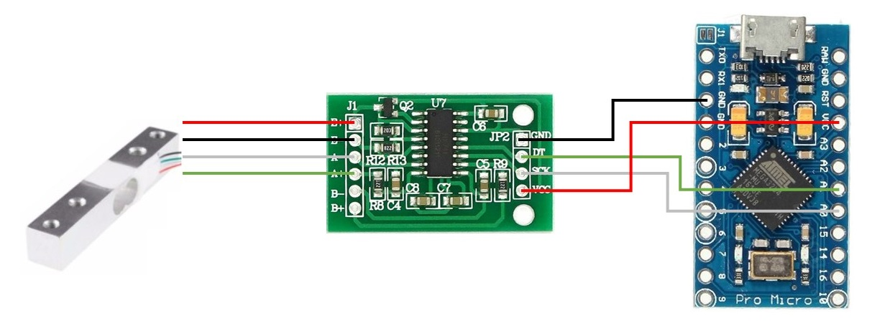
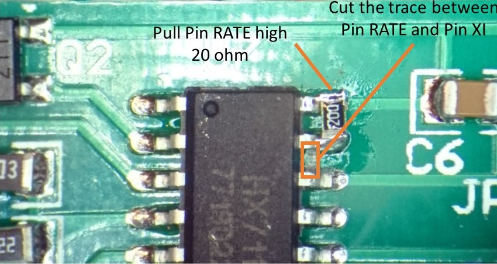

# A linear force-sensing handbrake for sim-racing.

---
__v1.0, 2018 Feb, 10th__ 
## 0. Get your hardware ready:
Check out what you need [here](https://www.thingiverse.com/thing:2766811).
## 1. Hardwiring:
check the following figure to see how it is connected.

## 2. Circuit modification:
check the following figure to set up 80Hz scan rate instead of 10Hz.

## 3. Install Arduino:
1.6.6 or above (according to the dependency).
## 4. Get libs:
Run deploy.bat. (I just copied and modified from the [Arduino Joystick Library](https://github.com/MHeironimus/ArduinoJoystickLibrary))
Or
You can get [HX711](https://github.com/bogde/HX711) and [ArduinoJoystickLibrary v2.0](https://github.com/MHeironimus/ArduinoJoystickLibrary/tree/version-2.0). Then [install](https://www.arduino.cc/en/Guide/Libraries) them for your Arduino IDE.
## 5. Flash your Arduino:
You may need to adjust the mapping between the sensor's raw data and the final output of the joystick. 
## Enjoy it!
