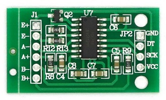

# 基于压力传感器的赛车模拟线性手刹<br />A linear force-sensing handbrake for sim-racing.

__v1.0, 2021 Jan, 1st__ 

----


----

## License

本项目基于Creative Commons Attribution 4.0协议开源。

<a rel="license" href="http://creativecommons.org/licenses/by/4.0/"></a><br />This work is licensed under a <a rel="license" href="http://creativecommons.org/licenses/by/4.0/">Creative Commons Attribution 4.0 International License</a>.

----

## English version: [here](#eng)

## 0. 和市面上现有设计的区别
- 常见的模拟器用手刹主要有两种原理：
    1. 用滑动变阻器：测量位移，通过胡克定律近似得到作用在手刹上的拉力。主要缺陷为滑动变阻器的碳膜容易磨损。
    2. 用霍尔传感器：原理也是测量位移，传感器与移动部件没有接触，不存在磨损问题。如果附近有磁场干扰，测量结果可能收到干扰。
- 使用压力传感器的优势：直接通过压力传感器测量施加在手刹上的力。

## 1. 零件列表：
- 硬件的零件设计在“hardware”文件夹下，主要为3D打印用的STL文件。部分由板材加工而来的零件参考下面提供的CAD图。

    模型及CAD图我也在 [Thingiverse](https://www.thingiverse.com/thing:2766811) 存了一份。

- 零件列表 (**备注：给出的图片和链接仅供参考，部分我当初试制时找的卖家店铺现在已经点不开了。** 整体来说在国内零件还是比较好买到的。)

    - **需要网购的零件**: 以下零件需在网上购买后自行加工。

        |零件|数量|参考图片|参考链接|备注|
        |----|----|---|---|---|
        |手刹 |1| |[淘宝](https://item.taobao.com/item.htm?spm=a1z09.2.0.0.41612e8duBrvWE&id=557912403614&_u=23gep5n5f23) |关键词：液压手刹 改装|
        |压力传感器|1||[淘宝](https://item.taobao.com/item.htm?spm=a1z09.2.0.0.41612e8duBrvWE&id=538121641487&_u=23gep5n7c8b)|量程：20kg<br>尺寸见图|
        |内螺纹圆柱销, Φ5\*60|1|| [淘宝](https://item.taobao.com/item.htm?spm=a1z09.2.0.0.41612e8duBrvWE&id=523969064235&_u=23gep5nd0e6)| 在一头有预制的M3内螺纹。另外一头最好选半圆形，或者自己用砂轮机打磨圆角 |
        |模具弹簧 TF12\*6\*55 |1||[淘宝](https://item.taobao.com/item.htm?spm=a1z09.2.0.0.41612e8duBrvWE&id=15134538245&_u=23gep5na2bc) |关键词：矩形 压簧 模具。黄色为小负荷，也可更换为其它颜色（不同负荷）或尺寸的弹簧以改变反馈手感，视具体选用的弹簧可能需要对一些部件尺寸重新设计|
        |HX711模块 |1||[淘宝](https://item.taobao.com/item.htm?spm=a1z09.2.0.0.41612e8duBrvWE&id=538121641487&_u=23gep5n7c8b)|
        |Arduino pro micro|1|| [ref](https://store.arduino.cc/usa/arduino-micro)|主要要选5V供电，带USB硬件栈的版本。|

    - **需要自己加工的零件**: 需要购买原料进行机加工或者3D打印

        |零件|数量|参考图片|参考链接|备注|
        |----|----|----|---|----|
        |传感器支架|1||[淘宝](https://item.taobao.com/item.htm?spm=a1z09.2.0.0.4a632e8d7Rbkiu&id=553634051051&_u=b3gep5n89f8)|建议买12.5mm长，60×15×4mm的U型铝槽a进行加工。装配时可能需要对手刹进行打磨（手刹对应位置宽度因为有焊缝，尺寸略宽，为52±0.5mm。 铝槽的内径为52mm。 |
        |传感器和支架间的垫片 |1|参见下面的CAD图|机加工| 用3mm的铝板自制。或者以100%的填充率3D打印可能也行。 |
        |传感器和弹簧导轨间的垫片 |1|参见下面的CAD图 |机加工|用3mm的铝板自制。或者以100%的填充率3D打印可能也行。 |
        |弹簧导轨护套 |1 (1+1+1)|参见 "upper_spring_sleeve.stl", "lower_spring_sleeve.stl" and "spring_rod_sleeve.stl".|3D打印| |
        |弹簧限位|1|参见 "stopper.stl".|3D打印||
        |电路板外壳 |1(1+1+1)|参见 "lower_shell.stl", "upper_shell.stl", "hook.stl" and "nut.stl" |3D打印||

    - **标准件**
    
        |螺丝螺母垫片|数量|备注|
        |----|----|----|
        |M8*16 沉头螺丝 |1|固定手刹和传感器支架，顶部 |
        |M8*16 螺丝 |1|固定手刹和传感器支架，底部 |
        |M8 垫片 |1| |
        |M5*28 螺丝 |2|将传感器固定在支架上 |
        |M5 垫片和螺母 |若干|可能也可以用M5的垫片代替传感器垫片|
        |M4*14 沉头螺丝 |2|传感器和弹簧导柱（不锈钢定位销）间垫片的固定|
        |M3*12 沉头螺丝 |1|固定弹簧导柱，螺丝长度取决于你买到的固定销的螺纹深度|
        |M3*16 螺丝 |4|固定弹簧导轨护套 |
        |M3*18 螺丝 |1|固定电路板外壳 |
        |M3*20 螺丝 |2|固定电路板外壳 |
        |M3*25 螺丝|1|固定电路板外壳 |
        |M3 垫片和螺母 |若干||

## 2. 五金件的加工 

### 传感器支架：
- 由买到的U型铝槽加工而来。

    


- 加工结果：

    

### 弹簧导轨垫片：
- CAD图：

    

### 传感器支架与传感器间垫片：
- CAD图:

    

## 3. 电路接线：
- 具体接线参考下图

    传感器到HX711模块的连接：红、黑、白、绿分别为VCC，GND，信号-和信号+。

    HX711模块到Arduino的连接：红、黑、白、绿分别为VCC，GND，时钟，数据。

    

## 4. 修改HX711的配置：
- 一般能买到的HX711模块都会被配置为运行在10Hz采样率下。一般对于电子秤一类的应用这个采样率足够了，但是对于赛车模拟器而言有些低。HX711芯片有两种采样速率可选，分别是10Hz和80Hz，通过一个管脚（RATE）的电平高低配置。默认RATE脚接地（低电平）。将RATE与地之间的引线切断，通过一个20欧（或者其它阻值的电阻）将其拉至高电平即可提高采样速率。

- 具体见下图

    

## 5. 组装
### 螺丝螺母装配图：


### 传感器部分的装配结果：


### 完整的装配教程参考YouTube视频.

[](http://www.youtube.com/watch?v=2aMNOjdhkCo "tutorial")

## 6. Arduino配置:
- v1.6.6 或者更高的版本。

## 7. Get libs:
- 运行deploy.bat. (修改自 [Arduino Joystick Library](https://github.com/MHeironimus/ArduinoJoystickLibrary), 测试时版本为 3d626fb, Dec 25, 2017)
- 或者手动下载 [HX711](https://github.com/bogde/HX711) (测试版本为 e80de1c, Jan 11, 2017) and [ArduinoJoystickLibrary v2.0](https://github.com/MHeironimus/ArduinoJoystickLibrary/tree/version-2.0). 然后手动 [配置](https://www.arduino.cc/en/Guide/Libraries) Arduino库。

## 8. 写入Arduino固件:
- 源代码为“handbrake/handbrake.ino”
- 需要根据个人习惯及具体购买到的传感器手动调整代码中将传感器数据映射至摇杆的几个参数。括号内依次为实时传感器数据，传感器数据下限，传感器数据上限，映射至摇杆的下限，映射至摇杆的上限。
    ```long zaxis = map(force, 0, 1100000, 0, 255);```

## 完工

----


## 0. <span id="eng">How this design is different than others and why using bending beam load cell</span>
- There are several existing solution on the market: 
    1. Using a sliding type potentiometer. Force is approximated by Hooke's law. The force is not directly measured. The potentiometer will wear out.
    2. Using a hall sensor. The force is approximated by displacement. The result might be affected if there was a magnetic field nearby.
- Using a load cell:

    The force applied on the handle is directly measured.

## 1. Get your hardware ready:
- Check out what you need is under the "hardware" folder, 3D print out STL files.

    Or you can find models in my [Thingiverse](https://www.thingiverse.com/thing:2766811).

- BOM (**Note: all links are JUST FOR REFERENCE. I didn't get the part from those sellers.**)

    - **Part 1**: You need to buy them online. I built this thing few years ago when I was in Beijing. So the REF links are just for reference. You need to find sellers that accessible in your area by your own.

        |Off-the-shelf parts|Number|image|REF link|Note|
        |----|----|---|---|---|
        |Handbrake |1| |[淘宝](https://item.taobao.com/item.htm?spm=a1z09.2.0.0.41612e8duBrvWE&id=557912403614&_u=23gep5n5f23) |Try to search for "hydraulic handbrake"|
        |Force sensor/Load cell|1||[淘宝](https://item.taobao.com/item.htm?spm=a1z09.2.0.0.41612e8duBrvWE&id=538121641487&_u=23gep5n7c8b)|Measure range: 20kg<br>Dimension: check the figure|
        |Stainless steel rod, Φ5\*60|1|| [淘宝](https://item.taobao.com/item.htm?spm=a1z09.2.0.0.41612e8duBrvWE&id=523969064235&_u=23gep5nd0e6)| With an M3 screw hole drilled and tapped in one end. Try to search for "5mm M3 female thread", "pin", or "rod". Not necessary to be stainless steel. |
        |Spring TF12\*6\*55 |1||[淘宝](https://item.taobao.com/item.htm?spm=a1z09.2.0.0.41612e8duBrvWE&id=15134538245&_u=23gep5na2bc) |Try to search for "yellow light duty die spring"|
        |HX711 module |1||[淘宝](https://item.taobao.com/item.htm?spm=a1z09.2.0.0.41612e8duBrvWE&id=538121641487&_u=23gep5n7c8b)|
        |Arduino pro micro|1|| [ref](https://store.arduino.cc/usa/arduino-micro)|Find the 5V version with built-in USB stack.|

    - **Part 2**: Some of them need some machining.

        |Homebrew parts|Number|Image|REF link|Note|
        |----|----|----|---|----|
        |Sensor rack|1||[淘宝](https://item.taobao.com/item.htm?spm=a1z09.2.0.0.4a632e8d7Rbkiu&id=553634051051&_u=b3gep5n89f8)|Check the CAD drawing below. I use a 12.5mm long 60×15×4mm U-shape aluminum channel to make this part. You may need to file the handbrake a little bit since its width is around 52±0.5mm, while the width of the aluminum slot is 52mm. |
        |Spacer for sensor and its'rack |1|Refer to the .stl/.png.|Homebrew| Check the CAD drawing below. I cut it from a 3mm aluminum plate. I think 3D print it is also possible. |
        |Spacer for sensor and spring rail |1|Refer to the .stl/.png. |Homebrew|Check the CAD drawing below. I cut it from a 3mm aluminum plate. I think 3D print it is also possible. |
        |Sleeve set |1 (1+1+1)|Refer to "upper_spring_sleeve.stl", "lower_spring_sleeve.stl" and "spring_rod_sleeve.stl".|Homebrew| 3D printed.|
        |Stopper|1|Refer to "stopper.stl".|Homebrew|3D printed. |
        |Circuitry's case |1(1+1+1)|Refer to "lower_shell.stl", "upper_shell.stl", "hook.stl" and "nut.stl" |Homebrew|3D printed.|

    - **Part 3**: Screws, nuts, and spacers
        |Screws, nuts, and spacers|Number|Note|
        |----|----|----|
        |M8*16 countersunk screw |1|Fixing the handbrake and sensor rack, top |
        |M8*16 screw |1|Fixing the handbrake and sensor rack, bottom |
        |M8 spacer |1|With the M8 screw |
        |M5*28 screw |2|Fixing the sensor and its' rack |
        |M5 spacer & nut |2+|You may need more to spacing the sensor and its' rack. Or, instead of making your own sensor spacer, use as many M5 spacers you need. |
        |M4*14 countersunk screw |2|Fixing the spacer for sensor and spring rail (rod). |
        |M3*12 countersunk screw |1|Fixing the rod. The length depends on your rod. |
        |M3*16 screw |4|Fixing the sleeve set to the handbrake |
        |M3*18 screw |1|Fixing the circuitry's case |
        |M3*20 screw |2|Fixing the circuitry's case |
        |M3*25 screw|1|Fixing the circuitry's case |
        |M3 spacer and nut |many||

## 2. Hardware 

### Sensor rack:
- You need to machine from the U-shape aluminum rack.

    

- Result:

    

### Shaft rack:
- CAD drawing:

    

### Spacer:
- CAD drawing:

    

## 3. Board wiring:
- Check the following figure to see how it is connected.

    For the connection between the load cell and the HX711 module, red, black, white, and green are VCC, GND, signal-, and signal+ correspondingly.

    For the connection between the HX711 and the Arduino, red, black, white, and green are VCC, GND, SCK, and DATA correspondingly.

    

## 4. Circuit modification:
- If you grab an off-the-shelf HX711 module, the chip is set to running at 10Hz, which may not be sufficient enough for a racing simulator. The chip has two mode, running at 80Hz or 10Hz. To switch in between two modes, you need to pull the pin RATE to high or low.

- Check the following figure to set up 80Hz scan rate instead of 10Hz.

    

## 5. Put everything together
### How screws and nuts fit:


### Sensor assembly result:


### Check out the video tutorial on YouTube.

[](http://www.youtube.com/watch?v=2aMNOjdhkCo "tutorial")

## 6. Install Arduino:
- v1.6.6 or above (according to the dependency).

## 7. Get libs:
- Run deploy.bat. (I just copied and modified from the [Arduino Joystick Library](https://github.com/MHeironimus/ArduinoJoystickLibrary), tested version 3d626fb, Dec 25, 2017)
- Or, you can get [HX711](https://github.com/bogde/HX711) (tested version e80de1c, Jan 11, 2017) and [ArduinoJoystickLibrary v2.0](https://github.com/MHeironimus/ArduinoJoystickLibrary/tree/version-2.0). Then [install](https://www.arduino.cc/en/Guide/Libraries) them for your Arduino IDE.

## 8. Flash your Arduino:
- The source code is "handbrake/handbrake.ino".
- You may need to adjust the mapping between the sensor's raw data and the final output of the joystick. 
    Parameters are: realtime raw data (force), raw data lower bound, raw data upper bound, joystick value lower bound, joystick value upper bound.
    ```long zaxis = map(force, 0, 1100000, 0, 255);```
## Enjoy it!
